# How to configure OutSystems to use identity providers using SAML

## Federated SSO Authentication using SAML

In order to set up a Federated Authentication in your OutSystems applications, using the SAML protocol to connect to external identity providers you can take advantage of the [IdP Forge component](https://www.outsystems.com/forge/component-overview/599/idp), a generic federated identity provider (IdP) connector. IdP allows your OutSystems applications to integrate with single sign-on (SSO) provided by most of the commercial Identity Provider companies.

Since [Platform Server Release Jul.2019 CP2](https://success.outsystems.com/Support/Release_Notes/11/Platform_Server) (August 23rd, 2019) you can configure a SAML 2.0 authentication for the whole environment directly in the Users application. Check the documentation on how to [Configure SAML 2.0 Authentication](https://success.outsystems.com/Documentation/11/Developing_an_Application/Secure_the_Application/End_User_Management/End_Users_Authentication/Configure_SAML_2.0_Authentication).

With this integration, when the users access an OutSystems application (Service Provider - SP), they are redirected to a web page (known as the enterprise's login manager) where they are prompted to enter their enterprise user name and password. Upon verification of the user’s login, the enterprise identity provider informs OutSystems application of the verified identity for the user who is logging in, and the user is redirected back to the portal website.

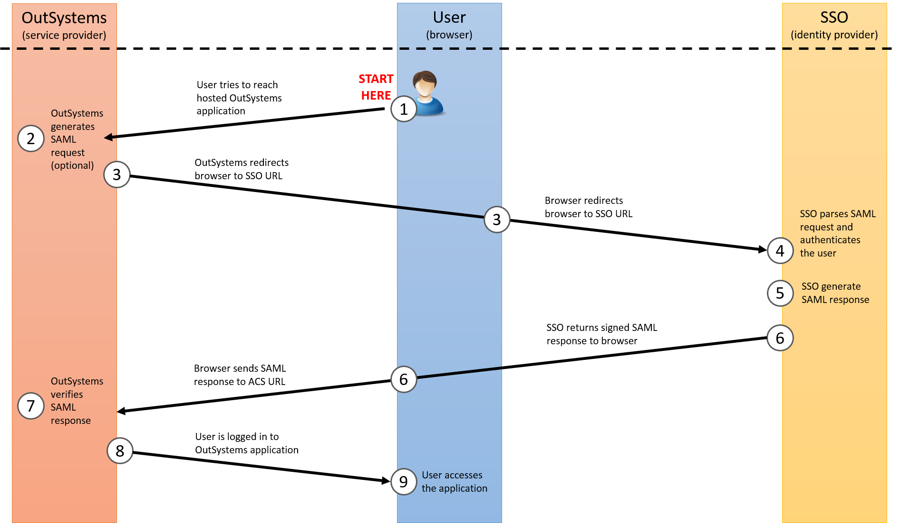

To successfully establish the connection between the IdP component and the Identity providers you'll need to change the authentication flow and configure both parties to redirect the user to the Login of the Identity Provider. In this article, we'll guide you through the needed setup.

## Configure your application to use IdP connector

### Login Flow

* Change **NoPermission** screen on Common Flow.

In a standard OutSystems application there is a Common Flow responsible for handling authentication and exception.

One of the scenarios is when a user tries to access a resource that requires the user is authenticated, and the user is not authenticated yet.

In that case, the application raises a Security exception that will be handled in Common flow and then redirects the user to the login screen.

So, the first step to integrate an OutSystems application to change this behaviour, and instead of redirect the user to the Login screen, redirect it to the Identity Provider.

1. Change **Preparation** of the **NoPermission** screen to redirect the user to the URL provided by **IdP_SSO_URL** action.

Note: if the system contains multiple tenants, the tenant switch has to have been done before calling IdP_SSO_URL.

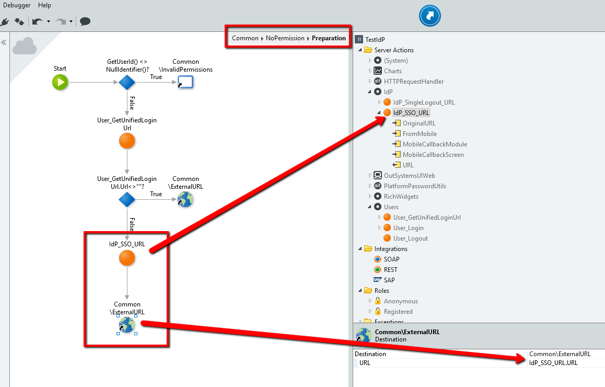

### Logout Flow

* Change **LoginInfo** web block on Common Flow (Optional: Single-logout).

In a standard OutSystems application the Common Flow is also responsible for handling Logout operation.

By default, the Logout will invalidate the session on the OutSystems application server, but with an IdP SSO scenario many times the logout must be also performed on IdP Server, redirecting the browser to a specific URL on IdP SSO server.

So, in order to achieve that, it's necessary to change the Logout default behaviour.

If your IdP Server allows a Logout initiated by the SP (IdP Connector), then configure the field **IdP server Single Logout URL** which should be provided by your IdP Server (the IdP Connector will generate the SAML messages to perform a Single-Logout).

Note: Your application should not call the system actions User_Logout or Logout. IdP connector is the one responsible for that call.

* Change **Preparation** of the **LoginInfo** to redirect the user to the URL provided by IdP Server

* If your IdP Server allows a Logout initiated by the SP through SAML messages: call the action **IdP_SingleLogout_URL** and call the **Common\ExternalURL** with its output.

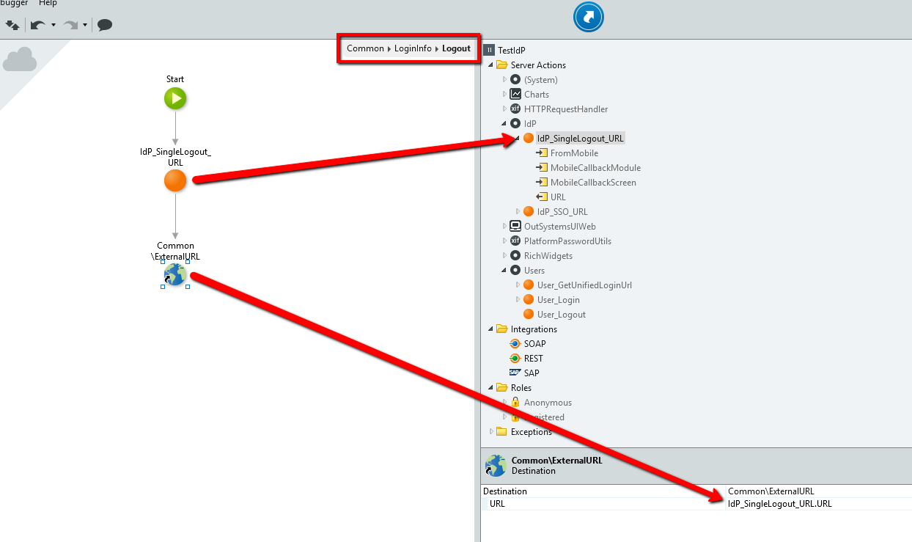

 

## Configure IdP connector

To configure the SAML Single Sign-on in the IdP component you will need to set up the values according to your Identity Provider.

* **IdP Server Issuer/Entity ID**: A URL that uniquely identifies your SAML identity provider (IdP Server). SAML messages sent from IdP server must match this value exactly in the `<saml:Issuer>` attribute of SAML message.

* **IdP server Single Sign-On URL**: The URL that IdP Connector should redirect to allow a user to sign in.

* **Certificate**: The X.509 public certificate issued by your identity provider. Used to check the signature of SAML messages from the IdPServer.

* **SP Issuer/Entity ID**: SAML Service Provider Issuer (SP Entity ID) sent in SAML messages from the IdP connector.

Optional (when required):

* **IdP server Single Logout URL**: Identity Provider Server Single Logout URL. Used when the server allows SingleLogout initiated by the SP.

* **IdPConnector (SP) Keystore**: The keystore that contains the private key and the public certificate that IdP connector uses to sign SAML messages sent to IdPServer (also to decrypt assertions if encrypted by IdP server). PFX/PKCS12 is the supported format.

* **KeyStore password**: Keystore password to protect the keys in it.

* **Session_Cookie** (site property): Variable that holds the cookie name that has the SessionId of the IdP connector (usually 'ASP.NET_SessionId')

## Configure Identity Provider - Examples

### Azure AD / ADFS

Since [Platform Server Release Jul.2019 CP2](https://success.outsystems.com/Support/Release_Notes/11/Platform_Server) (August 23rd, 2019) Azure AD (Azure Active Directory) authentication mode is directly available in the Users application, having the "Claims" settings already filled in with Azure AD default values. Check the documentation on how to [Configure Azure AD Authentication](https://success.outsystems.com/Documentation/11/Developing_an_Application/Secure_the_Application/End_User_Management/End_Users_Authentication/Configure_Azure_AD_Authentication).

 

1. Sign in to the [Azure Active Directory portal](https://aad.portal.azure.com/) and add the **OutSystems Azure AD** application from the gallery.

* Navigate to **Enterprise applications**

* Click **New application**.

* Search for **OutSystems Azure AD**.

* Select the application and click **Add**.

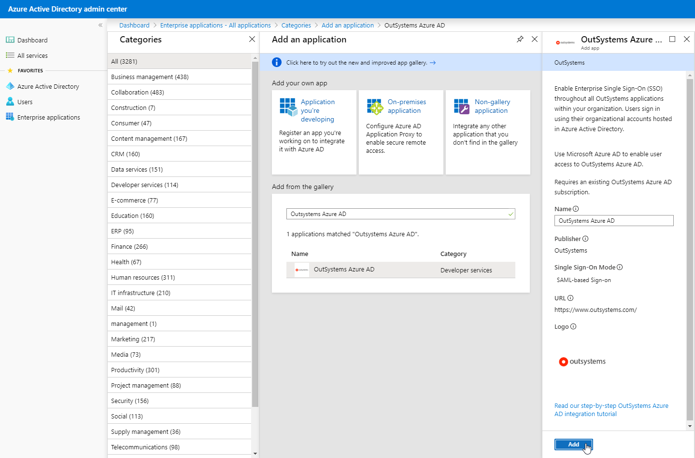

1. Select **SAML** as the single sign-on method.

* In the OutSystems Azure AD application dashboard click the **Single sign-on** entry.

* Select **SAML**.

1. Set up Single Sign-On with SAML.

* Click the Edit icon on the Basic SAML Configuration section.

* Set the required values accordingly.

    * **Identifier (Entity ID)**: *[http://YOUR_SERVER/IdP*/](http://your_server/IdP/)

    * **Reply URL (Assertion Consumer Service URL)**: *[https://YOUR_SERVER/IdP/SSO.asp*x](https://your_server/IdP/SSO.aspx)

* Alternatively, you can just upload the metadata file from the IdP connector.

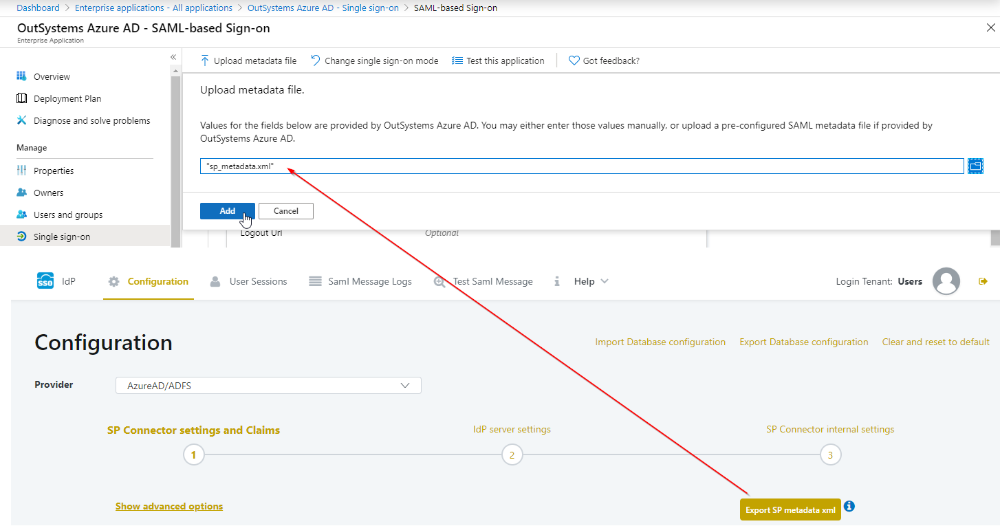

1. You can then [configure the IdP connector](https://success.outsystems.com/Documentation/How-to_Guides/How_to_configure_OutSystems_to_use_identity_providers_using_SAML#Configure_IdP_connector) with the provided information on sections 3 and 4 or just uploading the **Federation Metadata XML** file downloaded in the Azure AD application.

### Okta

Since [Platform Server Release Oct.2019](https://success.outsystems.com/Support/Release_Notes/11/Platform_Server) (October 3rd, 2019) the Users application includes specific configurations for OKTA authentication. Check the documentation on how to [Configure OKTA Authentication](https://success.outsystems.com/Documentation/11/Developing_an_Application/Secure_the_Application/End_User_Management/End_Users_Authentication/Configure_SAML_2.0_Authentication). 

1. Create an Okta trial account.

* Go the [Okta website](https://www.okta.com/free-trial/) and sign up to create a trial account using your company email address.

* You should then receive an email with your account details.

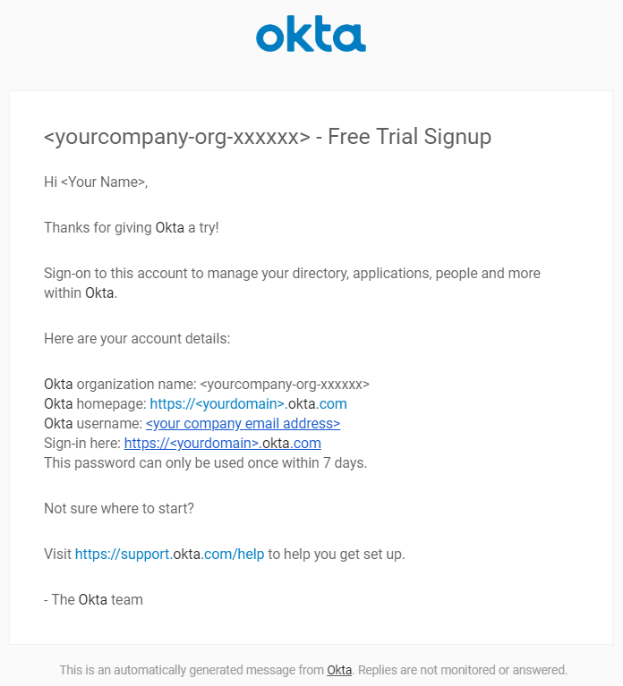

1. Sign-in to your Okta domain.

* Access your Okta domain homepage, as described in the email.

* Input your username and password and click **Sign In**.

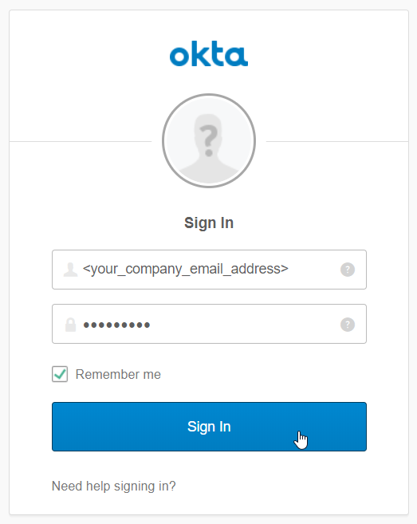

1. Add a SAML application to your Okta domain.

* Access the Admin Dashboard and click to **Add Application**.

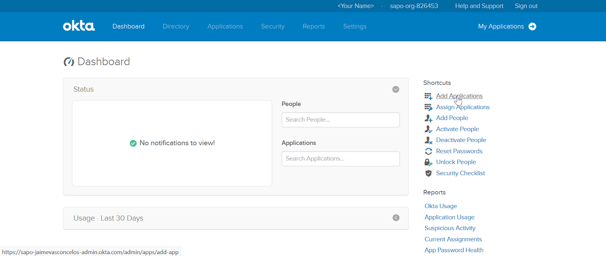

* Click on the **Create New App** button.

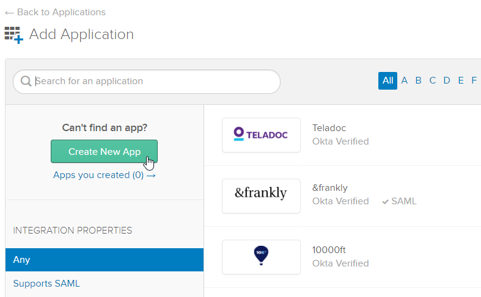

* Select Web and SAML 2.0 because we are creating a SAML integration for web applications. Click **Create** to continue.

* Define the **App Name**(e.g.: *OutSystems Okta*) and click *Next*

1. Configure the SAML settings for the integration.

* Set the **Single sign on URL**(URL in the OutSystems environment to handle the SAML response)

*[http://YOUR_SERVER/IdP/SSO.asp*x](http://your_server/IdP/SSO.aspx)

* Set the **Audience URI (SP Entity ID)**

*[http://YOUR_SERVER/IdP/SSO.asp*x](http://your_server/IdP/SSO.aspx)

* Click on the **Show Advanced Settings** link and set the remaining values

* **Digest Algorithm**: SHA1

* **Signature Algorithm**: RSA-SHA1

* **Assertion Signature**: Unsigned

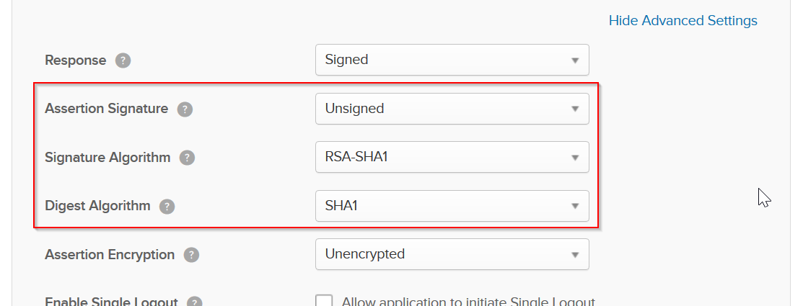

* Click *Next* and you’ll be asked for some information for feedback purposes. Select the option **I'm a software vendor. I'd like to integrate my app with Okta** and click *Finish *to complete the configuration.

* Finally, click **View Setup Instructions** to get the data needed to [configure the IdP connector](https://success.outsystems.com/Documentation/How-to_Guides/How_to_configure_OutSystems_to_use_identity_providers_using_SAML#Configure_IdP_connector).

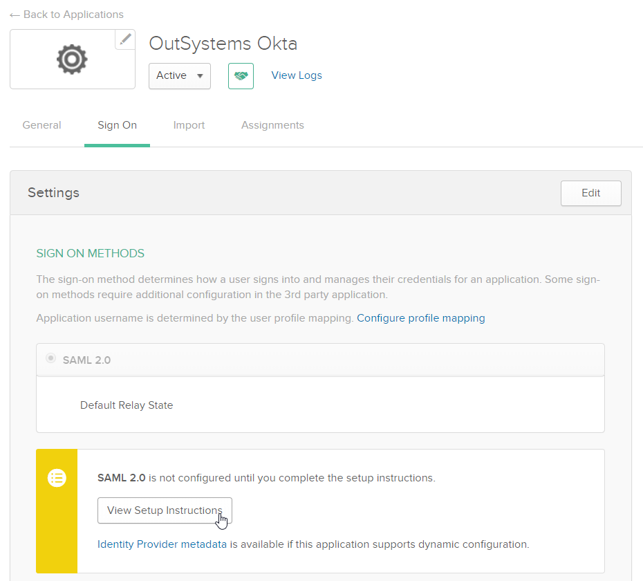

### OneLogin

Since [Platform Server Release Jul.2019 CP2](https://success.outsystems.com/Support/Release_Notes/11/Platform_Server) (August 23rd, 2019) you can configure a SAML 2.0 authentication directly in the Users application. Check the documentation on how to [Configure SAML 2.0 Authentication](https://success.outsystems.com/Documentation/11/Developing_an_Application/Secure_the_Application/End_User_Management/End_Users_Authentication/Configure_SAML_2.0_Authentication).

1. Create a [free OneLogin account](https://www.onelogin.com/signup).

2. Log in to the admin console.

3. Click on **Apps** tab then click on **Add App** button.

1. Search for **SAML** and select **SAML Test Connector (IdP)** option.

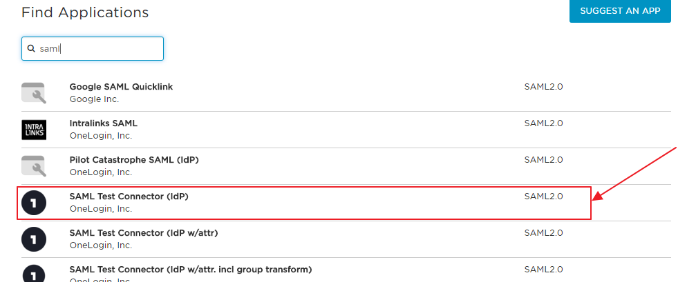

1. Configure *Display Name* of your application and then click on **Save** button.

2. Click on the **Configuration** tab and configure the following properties.

* **ACS (Consumer) URL Validator**: URL of the OutSystems environment to handle the SAML response ([http://YOUR_SERVER/IdP/SSO.aspx](http://your_server/IdP/SSO.aspx))

* **ACS (Consumer) URL**: URL of the OutSystems environment to handle the SAML response ([http://YOUR_SERVER/IdP/SSO.aspx](http://your_server/IdP/SSO.aspx))

1. Click on **SSO** tab and configure the following properties

* **SAML Signature Algorithm**: SHA-1

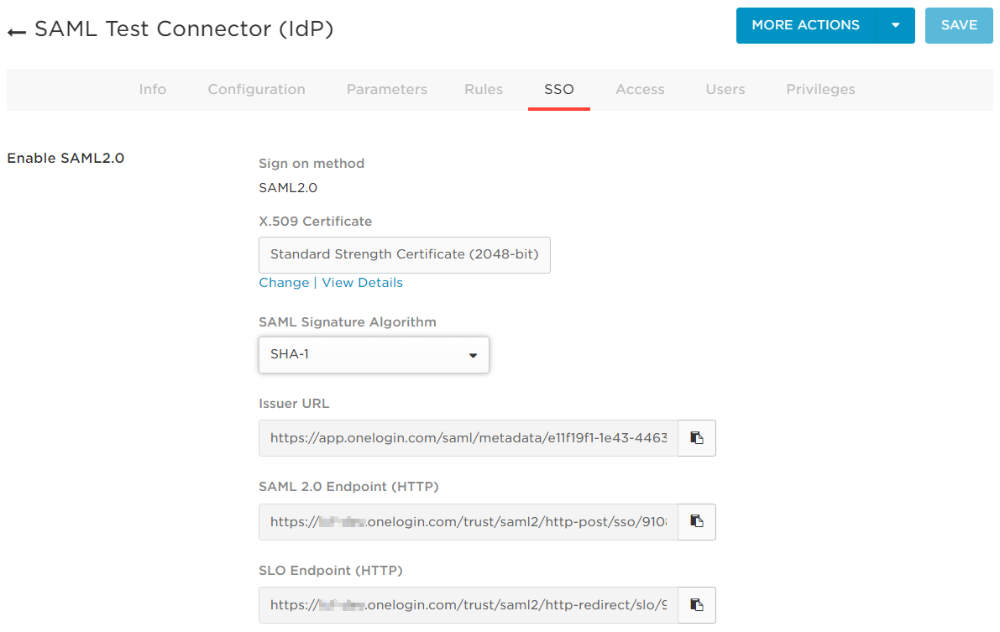

8. Finally, [configure the IdP connector](https://success.outsystems.com/Documentation/How-to_Guides/How_to_configure_OutSystems_to_use_identity_providers_using_SAML#Configure_IdP_connector) with the provided information.

### PingOne

Since [Platform Server Release Jul.2019 CP2](https://success.outsystems.com/Support/Release_Notes/11/Platform_Server) (August 23rd, 2019) you can configure a SAML 2.0 authentication directly in the Users application. Check the documentation on how to [Configure SAML 2.0 Authentication](https://success.outsystems.com/Documentation/11/Developing_an_Application/Secure_the_Application/End_User_Management/End_Users_Authentication/Configure_SAML_2.0_Authentication).

1. Create a [free Ping Identity account](https://www.pingidentity.com/).

2. Log in to the [admin console](https://admin.pingone.com/web-portal/login).

3. Click on the **Applications** tab then click on **Add Application** button.

1. Select **New SAML Application** option.

2. Configure application name, description, category and click on **Continue to Next Step**.

1. On **Application Configuration** configure the following properties

*  **Assertion Consumer Service (ACS)**: URL of the OutSystems environment to handle the SAML response ([http://YOUR_SERVER/IdP/SSO.aspx](http://your_server/IdP/SSO.aspx))

*  **Entity ID**: URL of the OutSystems environment to handle the SAML response ([http://YOUR_SERVER/IdP/SSO.aspx](http://your_server/IdP/SSO.aspx))

*  **Signing Algorithm**: RSA_SHA1

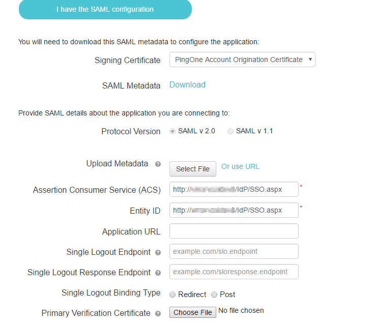

1. Click on **Continue to Next Step** and then **Save & Publish**.

2. Finally, [configure the IdP connector](https://success.outsystems.com/Documentation/How-to_Guides/How_to_configure_OutSystems_to_use_identity_providers_using_SAML#Configure_IdP_connector) with the provided information.

