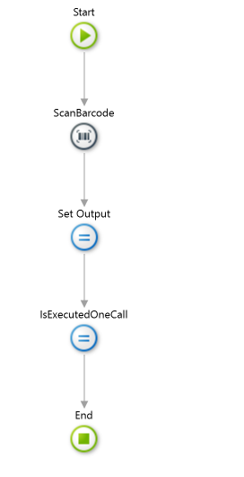

# How to use the Barcode Plugin in your OutSystems applications

You can use the Barcode Plugin in your OutSystems applications to scan barcodes and QR codes. 

## Download the Barcode Plugin from Forge

Download [the Barcode Plugin from the Forge website](https://www.outsystems.com/forge/component-overview/1403/barcode-plugin) and install it in your environment. Alternatively, you can also download it in your environment by selecting the OutSystems tab in Service Studio and searching for the plugin. 

## Add a reference to the plugin to your application

To scan barcodes and QR codes, you need to add the plugin to your application in Service Studio first.   

1. In Service Studio, click the **Manage Dependencies** toolbar button.

1. Select BarcodePlugin from the list of Producers and check all the required elements.

1. Click on **OK** to add a reference to these elements in your application. 

## Use the plugin in your application

To use the Barcode Plugin in your application, do the following:

1. In the Logic tab, expand the **Client Actions** and open the BarcodePlugin dropdown.

1. Drag the ScanBarcode action to the desired flow.
 
    

1. Use ScanResult to return the result of the scan. 

    

1. Publish the new version of your mobile app and test. 

When the instance of the ScanBarcode action in the flow runs, the Camera view will be enabled to scan the barcode or QR Code. 

## Additional configurations 

Barcode Plugin provides some additional configurations to improve the experience for the end-users when they scan a new barcode or QR code. 

You can optionally setup the following configurations: 

* **Helper Title**: Text to be displayed as the title of the scanner. Note that this is only used in Android.
* **Helper Instructions**: Text to be displayed on the instructions for the scanning. Note that this is only used in Android.
* **Camera**: There are two options for the camera, "back" and "front". The default value is "back".
* **Flash**: There are three options for the flash, "auto", "off" and "on". The default value is "auto".
* **DrawSight**: If set to "True", draws a red line of sight in the center of the scanner view. The default value is "True". 
