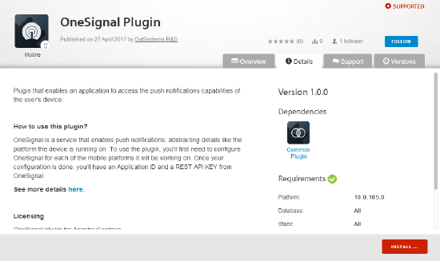
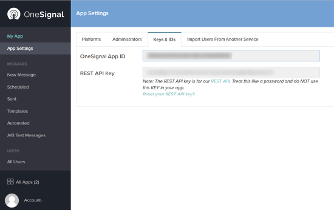
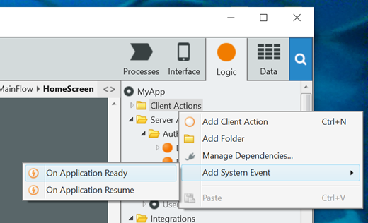
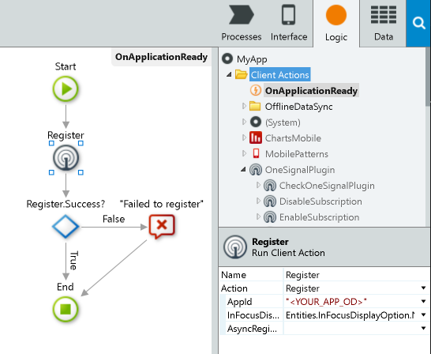
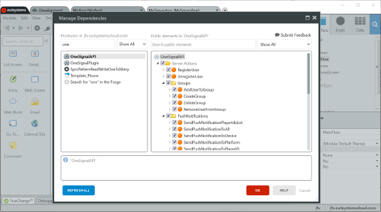
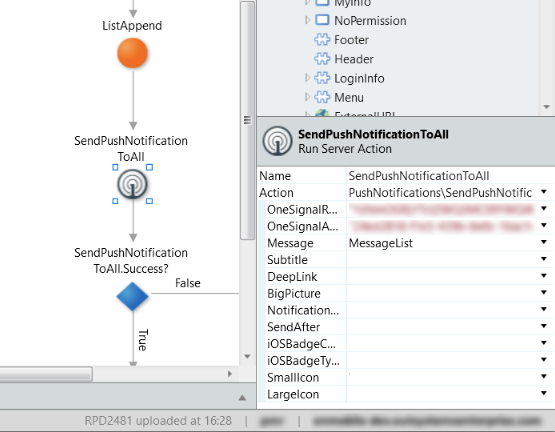
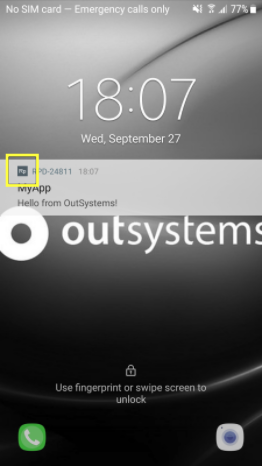
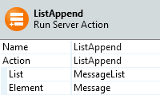

# How to Use Push Notifications with OneSignal

OneSignal is a service that enables push notifications, abstracting details such as the platform the device is running on. With the [OneSignal plugin](http://www.outsystems.com/forge/component/2119/onesignal-plugin/ "http://www.outsystems.com/forge/component/2119/onesignal-plugin/"), OutSystems applications can send and receive push notifications.

The image below shows a push notification in an Android smartphone.

## Configuring OneSignal

You need to configure OneSignal for each of the mobile platforms it will be working on. Once your configuration is done, you’ll have an Application ID and a REST API KEY from OneSignal.

You can configure OneSignal for iOS and Android.

* [Configure for iOS](https://documentation.onesignal.com/docs/generate-an-ios-push-certificate)
* [Configure for Android](https://documentation.onesignal.com/docs/generate-a-google-server-api-key "https://documentation.onesignal.com/docs/generate-a-google-server-api-key")

## Installing the OneSignal Plugin

Start by installing the [OneSignal plugin](http://www.outsystems.com/forge/component/2119/onesignal-plugin/ "http://www.outsystems.com/forge/component/2119/onesignal-plugin/") from the OutSystems Forge. Alternatively, go to the **OutSystems tab** in Service Studio and install from there.

## Receiving Notifications

For your app to receive notifications, you need to implement client-side logic to register the device in OneSignal.

Start by adding the OneSignal plugin to the mobile app in the **Manage Dependencies** menu option. This plugin contains the client-side actions to register the device.

In case you want to add logic to run on events over notifications, do the following:

1. Add the OneSignal block to the Layout block of your application.   

    

1. Add your logic to the event handlers of the OneSignal block: 

    * **OnNotificationReceived**: a Client Action that runs when the app receives a notification. 
    * **OnNotificationOpened**: a Client Action that runs when the user opens a notification. 

### Receiving Notifications with Deep Links for Android

If your app will be deployed to Android devices and you intend to use deep links in your notifications, add the following snippet to the `Extensibility Configurations` field of the Module:

    {
        "preferences": {
            "android": [
                {
                    "name": "AndroidLaunchMode",
                    "value": "singleTask"
                }
            ]
        }   
    }
    
This configuration changes how a new [activity](<https://developer.android.com/guide/components/activities/intro-activities>) from your Mobile App is launched. Read more about the activity launch mode [here](<https://developer.android.com/guide/topics/manifest/activity-element#lmode>).

This extra step ensures that Android end-users will be redirected to specific Screens when they click the OneSignal notification. No additional configuration is needed for iOS devices.

### Registering a Device with a User

If your users need to login to use the application, the device can be registered with that user.

One place to do it can be the “Login” screen.

Use the RegisterWithUser action to register the user along with the device.

Put it after the “DoLogin” action and it should look like this:

To set the AppId value, use the **OneSignal App ID** value from the OneSignal console.

By default, the registration action is performed asynchronously, sending the action to register the device in OneSignal service and continuing the logic execution without waiting for the registration action response. To change this behavior, set AsyncRegister parameter to `false`, blocking the code execution and waiting until the device is registered in OneSignal service before proceeding.

Save the **OneSignal App ID** and **REST API Key** values because you will need them later.

By default, notifications won’t be displayed when the application is already running in the foreground. To always display notifications, set property InFocusDisplayOptions to `Entities.InFocusDisplayOption.NOTIFICATION`.

### Registering a Device without a User

If your application does not have a login, the device can be registered without a user.

One place to do it can be the “On Application Ready” action.

Use the Register action to register the device. It should look like in the image below:

By default, the registration action is performed asynchronously, sending the action to register the device in OneSignal service and continuing the logic execution, without waiting for the registration action response. To change this behavior, set AsyncRegister parameter to `false`, blocking the code execution and waiting until the device is registered in OneSignal service before proceeding.

Furthermore by default, notifications won’t be displayed when the application is already running in the foreground. To always display notifications, set property InFocusDisplayOptions to `Entities.InFocusDisplayOption.NOTIFICATION`.

## Sending Notifications

To send notifications, you need to implement server-side logic. Add the OneSignalAPI in the Manage Dependencies… menu option. This API contains the server-side actions to send notifications.

Add the server-side logic to send the notification like in the image below:

To set the OneSignalRestAPIKey and OneSignalAppId values, use the values you saved earlier in this document.

By default, Android notifications are displayed using the bell icon. To replace this icon with the application icon, set the SmallIcon property to `"icon"` if you are generating your app using MABS 4 or below. Else, set the SmallIcon property to `"ic_launcher"`.

### Defining the notification message(s)

To define the text of the notifications to send, set the Message input parameter to a list of "Content" structures (the "Content" structure is defined in OneSignalAPI), containing each notification message and its respective language/locale.

In the following example, two local variables were defined in the SendReminder server action where the notifications are sent: a local variable Message of data type "Content" and a local variable MessageList of data type "Content List".

To send a notification with a simple message in English, do the following in the server action flow:

1. **Assign** the message text and the English language code `"en"` to the Message local variable of data type "Content"; 

    

2. **Append** this local variable to the list of notifications to send which is kept in the MessageList local variable of data type "Content List"; 

    

3. **Send** the notification supplying the MessageList variable as the Message input parameter. 

## Remarks

This article provides a simple example of implementing push notifications. However, OneSignalPlugin and OneSignalAPI provide further client and server-side functionality to implement other ways of pushing notifications. For example, on the client-side, add logic to take an action when the user opens the notification or, on the server-side, push a notification only to some specific users.

For more information about **OneSignalPlugin** and **OneSignalAPI**, use the tooltips by hovering over the elements in the Service Studio.

To know more about **OneSignal**, check [this documentation](https://documentation.onesignal.com/docs/product-overview).
