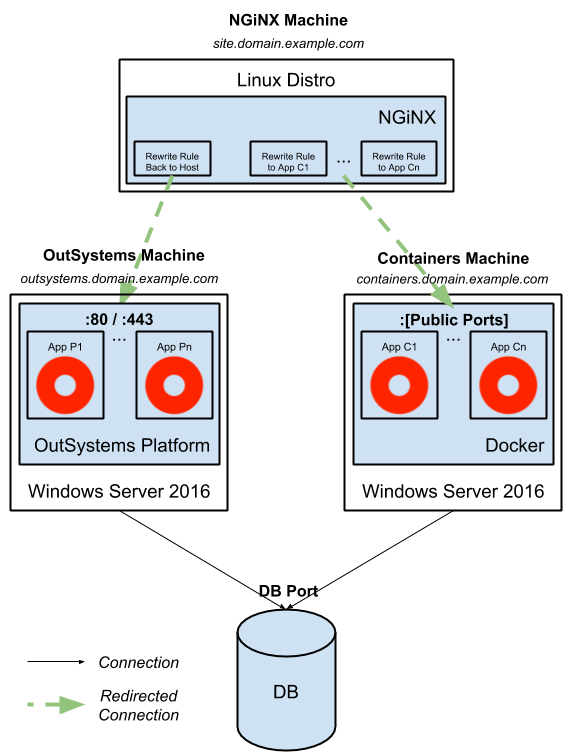

# How to set up NGINX as a Reverse Proxy

This document is part of the document [How to automate Docker container deployment with Jenkins](<faq-jenkins.md>) and instructs you how to set up NGINX as a reverse proxy for the test scenario.

In this example, we use two additional servers:

* Windows Server for a Container
* Linux Server for NGINX

**Additional settings for the OutSystems Machine**

The setup for this machine is explained in [How to automate Docker container deployment with Jenkins](<faq-jenkins.md>), but if you are using NGINX as the reverse proxy, you need to do these additional settings:

* [Configure SSL Offloading in the environment](https://success.outsystems.com/Support/Enterprise_Customers/Maintenance_and_Operations/Using_OutSystems_in_Reverse_Proxy_Scenarios/03_OutSystems_configurations_in_reverse_proxy_scenarios#C_-_End-to-end_SSL_and_SSL_Offloading)
* [Add the NGINX Machine's Network masks to Network Security](https://success.outsystems.com/Documentation/11/Managing_the_Applications_Lifecycle/Secure_the_Applications/Configure_an_Internal_Network)

**Windows Server - Containers Machine**

* Windows Server 2016
* Docker Enterprise Edition (latest version)
* Jenkins (version 2+ 64 bit)
* The executables `pscp.exe` and `plink.exe` from PuTTY (latest stable version)

**Linux Server - NGINX Machine**

* A Linux distro of your liking
* NGINX (latest version) to be used as a reverse proxy

## 1. Configure the network

Configure your network like this:

* The NGINX machine is publicly accessible (e.g site.domain.example.com)
* The OutSystems Machine is accessible from the address defined in the Global Deployment Zone (e.g outsystems.domain.example.com)
* The Container Machine is accessible from the given address defined in a Deployment Zone (e.g containers.domain.example.com)
* Both the OutSystems Machine and the Containers Machine are accessible to the NGINX machine (via ports 80 and 443)
* The Container Machine is accessible to the OutSystems Machine from the port configured for Jenkins (the default is 8080)
* Both the OutSystems Machine and the Containers Machine can reach the OutSystems database

## 2. Configure NGINX

These are the basic NGINX configuration steps for to test a deployment scenario. Adapt it to your requirements.

1. Copy the contents of the [general NGINX configuration file](<https://github.com/OutSystems/ContainerAutomation/blob/master/misc/prerequisites/nginx/configs/nginx.conf.example>) to `/etc/nginx/nginx.conf`. The file has the basic common settings for the NGINX service.

2. After adapting [server NGINX configuration file](<https://github.com/OutSystems/ContainerAutomation/blob/master/misc/prerequisites/nginx/configs/server.conf.example>) to your scenario, as instructed in the comments, copy its contents to `/etc/nginx/conf.d/testing_containers.conf`. This configuration file has settings more specific for our test scenario, namely how to handle SSL Offloading/Termination.

3. Configure a user with read/write privileges to, at least, the `/etc/nginx/conf.d/` folder and with the permissions to restart the NGINX service. The `DockerEEPlusNGiNX` module needs these user credentials to copy the `location` config files to that folder and restart the NGINX service to apply the changes.

## 3. Configure the DockerEEPlusNGiNX Container Automation module

In the Container Machine:

1. Place the `pscp` and `plink` executables to `C:\putty\` (this is the default folder).

2. Go to your local [`DockerEEPlusNGiNX` module Settings file](<https://github.com/OutSystems/ContainerAutomation/blob/master/modules/DockerEE/DockerEEPlusNGiNX/Settings.psm1>) and configure the settings as described by the comments. This file groups various required settings to the module, such as which machine to connect, what user credentials to use, and where to find the required executables.