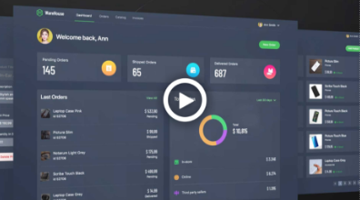

# How to Add Video to Your Applications

This article describes how to add videos to your web applications using [OutSystems UI Patterns](https://outsystemsui.outsystems.com/OutSystemsUIWebsite/PatternOverview).

There are different ways to add videos to your OutSystems web applications:

* [By using a video file reached via URL](#add-video-files-to-your-app);
* [By using a local video file kept as a Resource](#add-video-files-to-your-app);
* [By streaming a video from YouTube, Vimeo, or other streaming platforms](#how-to-embed-video-streaming).

## How to Add Video Files to Your Web Application { #add-video-files-to-your-app }

For the first two options, use the OutSystems UI Video Pattern where you can add the URL of a video file stored at a web server, or upload a video file to your OutSystems server and use it at a Resource. To learn about these two options refer to the [Video Pattern](https://success.outsystems.com/Documentation/11/Developing_an_Application/Design_UI/Patterns/Using_Web_Patterns/Controls/Video) documentation.

## How to Embed Video Streaming  { #how-to-embed-video-streaming }

If you want to embed a video from a streaming platform like YouTube, Vimeo, or other streaming platforms, perform the following steps.

1. Open the video you want to embed in your app in your Internet browser.

1. Use the Share option on the video and select the *Embed* option.

1. Copy the source video path for embedding:

    

1. Write down the video *width* and *height* in case you want to use the default video size:

    

1. In the Interface tab of Service Studio, drag the [Iframe](https://success.outsystems.com/Documentation/11/Developing_an_Application/Design_UI/Patterns/Using_Web_Patterns/Utilities/Iframe) block from the Toolbox into your application's screen.

1. At the Properties tab paste the embed URL into the SourceURL field.

    

1. Type the video title. This field is optional.

1. Type the Height and Width values you wrote down to embed the video with its default size or use your own values. This field is optional.

Your video is now embedded in your application.
    
