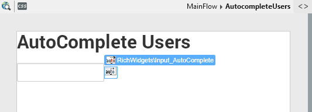
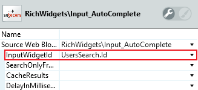
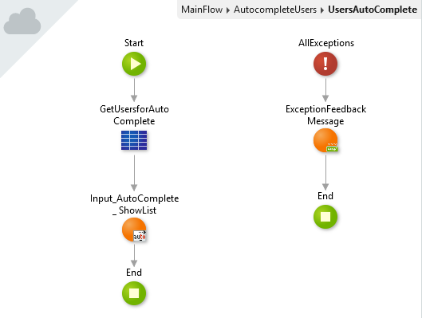
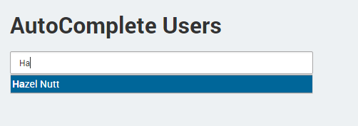

# How to create a search field with autocomplete

How can I implement an input field that has word prediction without using scafolding or SILKUI Select2?

For example: I have a search field where I want to choose a user; I want to dynamically query the database while I type to be presented with a list of suggestions.
Since I have a long list of users I would prefer to avoid using Select2 which has to return all of my users to populate a Combo Box or List Box before being able to start the client-side filtering. 

## Answer

To create a **search field** with **autocomplete** follow these steps:

1. Set the `Name`and `Variable` properties of the search field Input Widget to a Local Variable (in this case `UserSearch` and `Name_Search`).

    

    
    
1. Add an Input_AutoComplete RichWidget next to the Input Widget and set the `InputWidgetId` property to the Id of the Input.

    

    

1. Set the `On Notify`>`Destination` property of Input_AutoComplete to a newly created Screen Action, in this case **UsersAutoComplete**.

    

1. Add an Aggregate to the Screen Action and create a Filter using the Local Variable to limit the query results according to what is typed in the Input Widget.

    

    In this case the Filter `Users.Name like "%"+Name_Search+"%"` only retrieves users whose `Name` Attribute includes what is typed in the Input Widget.

1. Add an **Input\_AutoComplete\_ShowList** Server Action after the Aggregate.

    Set the `Action`>`InputWidgetId` property to the Id of the Input and the `Action`>`List` to the Aggregate's List, in this case `GetUsersforAutoComplete.List`.

    

    Be sure to map the `Label`and `Identifier` properties; the `Label` holds the value displayed in the autocomplete list and the `Identifier` holds the Identifier of those values.

    The Screen Action will look similar to the following image:

    

    The action queries the database for the **autocomplete** suggestions that appear below the Input field.

After these steps the search field shows a list of suggestions that changes as you type:

To access the Identifier of the selected user use the **Input_AutoComplete_GetIdentifier** Server Action to access the Identifier of the selected user.

