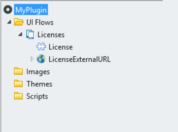

# Does OutSystems support CocoaPods?

Yes, OutSystems currently provides support for CocoaPods-dependent plugins that are built using Objective-C.

## What is CocoaPods?

CocoaPods is a dependency manager for Swift and Objective-C Cocoa projects that includes over 36 thousand libraries and is used by more than 2 million apps.

This new feature allows OutSystems 10 to integrate with even more Cordova plugins with third-party libraries and frameworks dependencies for iOS platforms. This means OutSystems developers have a larger set of Cordova plugins available to use in their applications.

By using CocoaPods, developers can save a lot of tedious work when using Cordova plugins. Let's use [phonegap-plugin-push](https://github.com/phonegap/phonegap-plugin-push "https://github.com/phonegap/phonegap-plugin-push") as an example. Previously, in order to use it, you had to add all the dependencies by hand in your plugins.xml file. Next, you needed to get the source code for each of the dependencies and build the code for each dependency targeting every supported architecture. This was both time-consuming and error-prone.

Now, with CocoaPods support, developers only need to include the phonegap- plugin-push plugin in their application, and OutSystems takes care of all the dependencies work for you.

Note that, for now, OutSystems only supports Objective-C Cocoa projects.

## How to know if your Plugin uses CocoaPods?

If you're curious and want to know if your plugin uses CocoaPods, follow the steps described below:

1. In your environment, open your plugin module.

1. Click the plugin module and open the extensibility configurations.

    

    

1. Here you will find a JSON with the URL or the identifier for your plugin location.

    

1. Open this URL in the browser and search for a plugin.xml file (check [this example](https://github.com/phonegap/phonegap-plugin-push/blob/master/plugin.xml "https://github.com/phonegap/phonegap-plugin-push/blob/master/plugin.xml")).

    

1. Open the plugin.xml file and search for podspec framework (check [this example](https://github.com/phonegap/phonegap-plugin-push/blob/v2.0.0/plugin.xml#L87 "https://github.com/phonegap/phonegap-plugin-push/blob/v2.0.0/plugin.xml#L87")).
