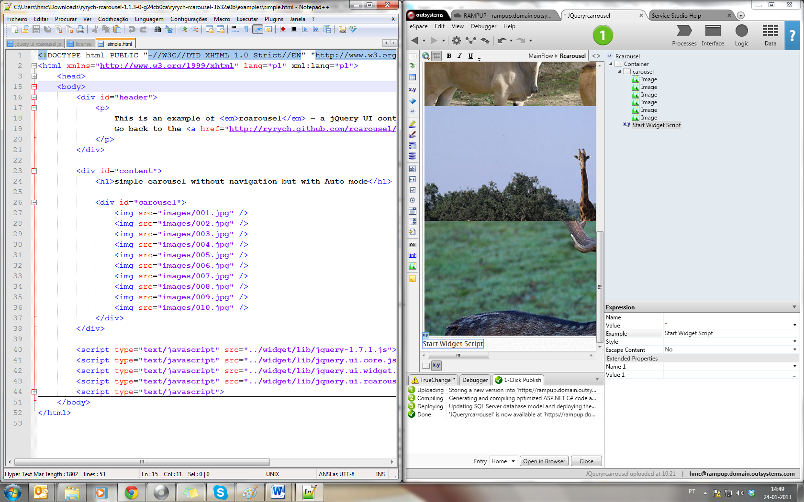
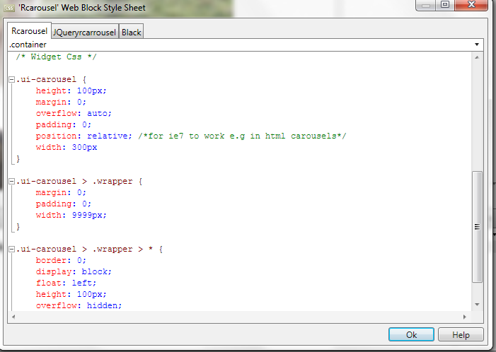
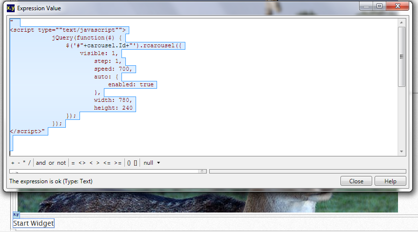
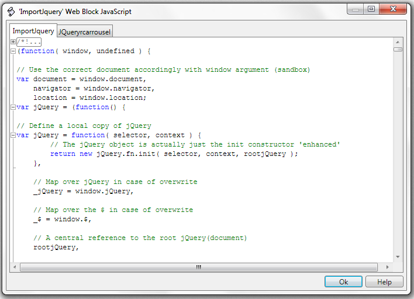

# How to include a jQuery plugin

### Question

How to integrate a jQuery plugin with OutSystems Platform? For example, a carousel?

### Answer

Use a web block to encapsulate the code, style, and resources of the jQuery plugin.

1. Download the plugin code, usually a zip archive with several files;

2. Create a web block with the files in the archive;

3. Add optional parameters to the web block to control the plugin;

4. Add an un-escaped Expression to the web block to run JavaScript that activates the plugin;

5. Include the web block in your web screens.

6. If needed, assign CSS styles to the containers.

As an alternative, you could import the files as direct resources of your eSpace. But since the resources imported are not visible to other eSpaces, it is harder to share your widget.

​The example below uses a web block to encapsulate a carousel with specific images, using the jQuery plugin rcarousel. The web block has:

* The Javascript of the plugin;

* The CSS styles of the plugin;

* A set of images;

* Some HTML that references the images;

* An expression to activate the carousel.

The image shows the structure of the web block.

The image below shows the CSS styles of rcarousel as the style sheet of the web block.

Finally, use an un-escaped expression at the end of the web block to start the jQuery code, based on an example from the rcarousel documentation.

To pass the 'id' attribute of the container to jQuery:

1. On the container properties, name the container. In our example, the container is called 'carousel'.

2. In Javascript, use `name.Id` to retrieve the id generated by OutSystems Platform. In our example, `'carousel.Id'`.

As an alternative, the carousel could be based on a unique CSS class instead of an id attribute.

However, the rcarousel plugin uses jQuery. There are two alternatives to include jQuery:

* Include a reference to jQuery in the layout. jQuery will be loaded in all pages that use the layout.

* Create a jQuery web block, and include this block when rcarousel is needed. You can even have rcarousel use the jQuery web block.

The example below shows a web block importJquery with the contents of jQuery.js pasted as the Javascript of the block.

If you include third-party code in an eSpace, remember to check the license and copyright before you share your eSpace.

More information:

[**eSpace**](https://success.outsystems.com/@api/deki/files/1512/JQueryrcarrousel.oml?revision=1 "https://success.outsystems.com/@api/deki/files/1512/JQueryrcarrousel.oml?revision=1")

Sample eSpace with a jQuery rcarousell.

[**rcarousel**](http://ryrych.github.com/rcarousel/)

A continuous jQuery UI carousel by Wojciech Ryrych, with a [simple example carousel](http://ryrych.github.com/rcarousel/examples/simple.html) without navigation.

[**Adding JavaScript**](http://www.outsystems.com/help/servicestudio/7.0/default.htm#Web_User_Interface/Adding_Java_Script.htm)

How to add JavaScript functions to elements.

[**About resources**](http://www.outsystems.com/help/servicestudio/7.0/default.htm#Managing_Resources/About_Resources.htm)

How to use resources to include all sorts of files when publishing your eSpace.

[**Display an expression**](http://www.outsystems.com/help/servicestudio/7.0/default.htm#Web_User_Interface/Display_an_Expression.htm)

How to compute an expression at runtime in a web screen.

[**Un-escape expression contents**](http://www.outsystems.com/help/servicestudio/7.0/Language_Reference/Expressions/Un-escape_Expression_Contents.htm)

How to include JavaScript code in a web screen, using an [Expression](http://www.outsystems.com/help/servicestudio/7.0/default.htm#Web_User_Interface/Display_an_Expression.htm).

[**Web Design implementation guidelines**](http://www.outsystems.com/NetworkForums/ViewTopic.aspx?TopicId=9707&Topic=OutSystems-Application%27s-Web-Design-implementation-guidelines)

Notes that IDs are automatically generated by OutSystems Platform. Applications should use CSS classes for styling.

