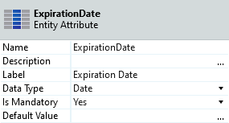
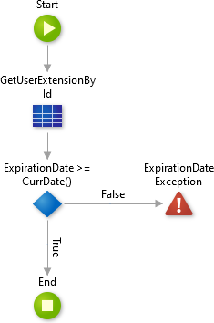
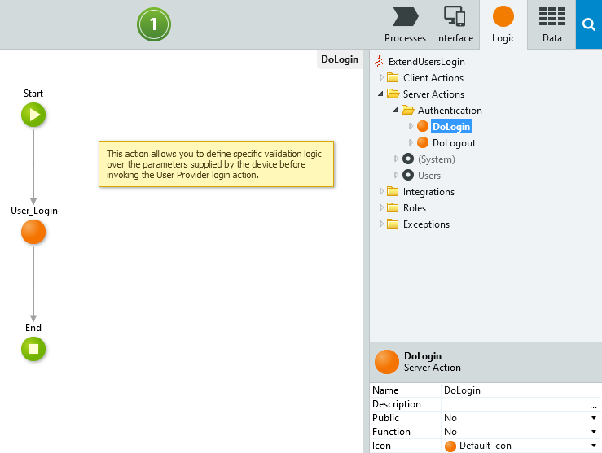

# How to add extra logic to Users' login

In some scenarios, the default built-in login mechanism for end-users may need to be extended.
Some common scenarios that require such extension are:

* Validate if the user is active on an external system
* Captcha validation
* Validate extra login data (besides username and password)

To successfully extend the existing end-users login logic you will need to perform three steps:

1. Extend the Users' data model
1. Create the server-side validation logic
1. Extend the default Login action

## Extend the Users' data model

The existing Users data model cannot be modified, since it part of the core of the OutSystems platform.
However it can be extended, which allows for customizations while still relying on the core authentications mechanisms.

To extend the Users' data model it is required to create a new Entity with a [1-to-1 relationship](https://success.outsystems.com/Documentation/11/Developing_an_Application/Use_Data/Data_Modeling/Entity_Relationships/Create_a_One-to-One_Relationship) to the User entity.

The following steps can be applied in Reactive Web, Mobile and Traditional Web applications.

1. Inside your module that contains the Login screen, switch to the **Data** tab.
You should have a reference to the User entity, located under _(System_).

    

1. Add a new Entity, named **UserExtended**.

1. Change the **Id** attribute Data Type to _User Identifier_.
This will create a 1-to-1 relationship between the User entity and your UserExtension entity.

    

1. Add the attributes needed for your particular use case.
For instance, add an attribute named **ExpirationDate** with the _Date_ data type.

    

    The attribute used here is an example.
    Later on, we will validate that the expiration date is in the future, and in such case the user will be able to login, otherwise, the login will be denied.
    Note that we are not implementing the funcionationality to fill the attribute with data.
    For that, you would need to create a backoffice or automate the creation of the records in the UserExtension entity.

## Create the server-side validation logic

For security reasons, all validations related to authentication should be done at the server-side (i.e. inside a Server Action).

In the following steps a Server Action will be created that validates if the Expiration Date is in the future.
In the oposite scenario, the expiration date is in the past, an Exception will be raised.

1. In the Logic tab, create a new Server Action named **ValidateUserExpirationDate**.

1. Inside the flow of the _ValidateUserExpirationDate_ server action, add an Aggregate that fetches the data from the UserExtension entity.
Use the following filter `UserExtension.Id = GetUserId()` to ony fetch the data for the current user.

    As best practice you may also set the Max. Records property of the Aggregate to 1.

1. Add an If after the Aggregate with the following Condition `GetUserExtensionById.List.Current.UserExtension.ExpirationDate >= CurrDate()` where _GetUserExtensionById_ is the name of the Aggregate created in the previous step.

1. Connect the True branch of the If to an End.

1. Connect the False branch of the If to a Raise Exception.

    You may need to create a new Exception if you don't have one created already.

1. The flow should be similar to

    

    More complex validations can be performed depending on your specific use case.
    Adapt the server action created to match you specific requirements.

## Change the default Login action

The actual Login logic is different depending on the type of application you are working on.

If your application is Traditional Web, skip the following section.

### In Reactive Web and Mobile

The default login logic is implemented in multiple places.
You have the Login screen (located in the Interface tab, under the Common UI Flow).
Upon login, the Login client action of the screen is executed.
This client action submits the login information to the server by executing the DoLogin Server Action.
This Server Action can be found in the Logic tab under the Server Actions > Authentication folders.

Extending the Login logic should be done at the server side, namely inside the DoLogin action.

After the existing User_Login, add another Run Server Action to the **ValidateUserExpirationDate** server action created in the previous section.

Note that due to the way the **ValidateUserExpirationDate** is defined, the actual login will be aborted (due to the raise exception) if the Expiration Date is in the past.

### In Traditional Web

The default login logic is implemented inside the Login screen (located in the Interface tab, under the Common UI Flow).

Add a Run Server Action immediately after the User_Login to the **ValidateUserExpirationDate** server action created before.

Note that if the Expiration Data is in the past, an Exception will be raised inside the **ValidateUserExpirationDate**.
That will cause the login to be aborted.
